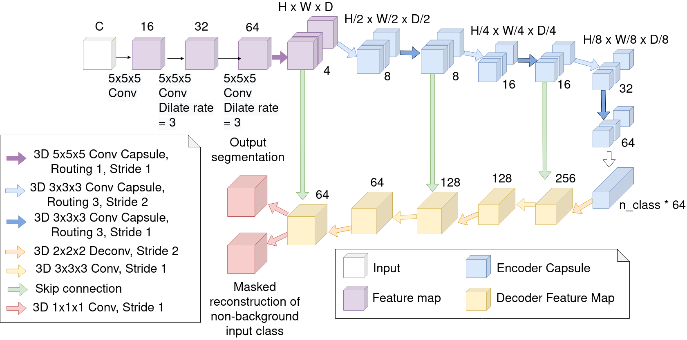

* [Introduction](#3d-ucaps-3d-capsules-unet-for-volumetric-image-segmentation)
* [Usage](#usage)
* [Model Zoo](#model-zoo)

# 3D-UCaps: 3D Capsules Unet for Volumetric Image Segmentation

3D-UCaps is a voxel-based Capsule network for medical image segmentation. Our architecture is based on the symmetry U-net with two parts: the encoder forms by Capsule layers, whereas the decoder contains traditional convolutional layers. 3D-UCaps, therefore inherits the merits from both Capsule networks to preserve the part-to-whole relationship and CNNs to learn translational invariant representation. We conducted experiments on various datasets (including iSeg-2017, LUNA16, Hippocampus, and Cardiac) to demonstrate the superior performance of 3D-UCaps, where our method outperforms the baseline method [SegCaps](https://github.com/lalonderodney/SegCaps) while being more robust against rotational transformation when compared to 3D-Unet.



Details of the UCaps model architecture and experimental results can be found in our [following paper](https://rdcu.be/cyhMv):
```
@inproceedings{nguyen20213d,
  title={3D-UCaps: 3D Capsules Unet for Volumetric Image Segmentation},
  author={Nguyen, Tan and Hua, Binh-Son and Le, Ngan},
  booktitle={International Conference on Medical Image Computing and Computer-Assisted Intervention},
  pages={548--558},
  year={2021},
  organization={Springer}
}
```

**Please CITE** our paper when UCaps is used to help produce published results or incorporated into other software

## Usage

### Installation
We provide instructions on how to install dependencies via conda. First, clone the repository locally:
```
git clone https://github.com/VinAIResearch/3D-UCaps.git
```

Then, install dependencies depends on your cuda version. We provide two versions for CUDA 10 and CUDA 11
```
conda env create -f environment_cuda11.yml
or
conda env create -f environment_cuda10.yml
```

### Data preparation
Download and extract these datasets:
* iSeg-2017 challenge (infant brain MRI segmentation): <https://iseg2017.web.unc.edu/download/>
* Lung Nodule Analysis 2016 (LUNA16): <https://luna16.grand-challenge.org/Download/>
* Cardiac and Hippocampus dataset from Medical Segmentation Decathlon: <http://medicaldecathlon.com/>

We expect the directory structure to be the following:
```
path/to/iseg/
  domainA/
  domainA_val/

path/to/cardiac/
  imagesTr
  labelsTr

path/to/hippocampus/
  imagesTr
  labelsTr

path/to/luna/
  imgs
  segs
```

**Note**: there are some files in LUNA16 dataset can lead to an error when training so we have removed it:
```
1.3.6.1.4.1.14519.5.2.1.6279.6001.771741891125176943862272696845.mhd
1.3.6.1.4.1.14519.5.2.1.6279.6001.927394449308471452920270961822.mhd
```

### Training

Arguments for training can be divided into 3 groups:

1. Trainer args to initialize [Trainer](https://pytorch-lightning.readthedocs.io/en/latest/common/trainer.html#trainer-class-api) class from Pytorch Lightning.

   * Important arguments: `gpus`, `accelerator`, `check_val_every_n_epoch`, `max_epochs`.
   * Fix arguments in `train.py`: `benchmark`, `logger`, `callbacks`, `num_sanity_val_steps`, `terminate_on_nan` 
2. Model args depend on which model you use (UCaps, SegCaps or U-net) and defined in `add_model_specific_args` method of that module. 

   * Important arguments: `in_channels`, `out_channels`, `val_frequency`, `val_patch_size`, `sw_batch_size`, `overlap`. The last three args are use in [sliding window inference](https://docs.monai.io/en/latest/inferers.html#sliding-window-inference) method from MONAI library.
3. Args specific for training: `root_dir`, `log_dir`, `dataset`, `fold`, `cache_rate`, `cache_dir`, `model_name`, `train_patch_size`, `num_workers`, `batch_size`, `num_samples`.

   * `cache_rate` and `cache_dir` define whether you want to use [CacheDataset](https://docs.monai.io/en/latest/data.html?highlight=ThreadBuffer#cachedataset) or [PersistentDataset](https://docs.monai.io/en/latest/data.html?highlight=ThreadBuffer#persistentdataset) when loading data.
   * `num_samples` is a arg in [RandCropByPosNegLabel](https://docs.monai.io/en/latest/transforms.html#randcropbyposneglabel) method, the effective batch size is `batch_size` x `num_samples`.

The full list of arguments can be shown through the command:
```
python train.py -h
```

We provide bash script with our config to train UCaps model on all datasets and can be run as follow:
```
bash scripts/train_ucaps_iseg.sh
```

### Validation
Arguments for validation can be divided into 3 groups:

1. Trainer args to initialize [Trainer](https://pytorch-lightning.readthedocs.io/en/latest/common/trainer.html#trainer-class-api) class. The only argument we need to use here is `gpus`.
2. Args for [sliding window inference](https://docs.monai.io/en/latest/inferers.html#sliding-window-inference) method
3. Args specific for validation `root_dir`, `output_dir`, `save_image`, `model_name`, `dataset`, `fold`, `checkpoint_path`

The full list of arguments can be shown through the command:
```
python evaluate.py -h
```

We provide bash script with our config to validate trained UCaps models on all datasets, you just need to download our models in [Model Zoo](#model-zoo) and put them in `logs` folder. After that, you can run the evaluation script for targeted dataset as follow:
```
bash scripts/evaluate_ucaps_iseg.sh
```

### Rotation experiment
Same with validation but add two more arguments `rotate_angle` (in degree) and `axis` (z/y/x or all) to create test rotated subject.

The full list of arguments can be shown through the command:
```
python evaluate_iseg.py -h
```

We provide bash script with our config to compare between trained UCaps ([download](https://drive.google.com/file/d/1WdyGlopAoI-nDVuqfKOaFOXmQUSRD0FA/view?usp=sharing)) and U-net ([download](https://drive.google.com/file/d/1kR-AkjPp36hOTrZ_4ZdtgIpP4PQouHSB/view?usp=sharing)) on subject 9th of iSeg-2017 dataset, the first arugment is `rotate_angle` and the second argument is `axis`:
```
bash scripts/evaluate_rotation.sh 0 z
```

### Rotation experiment on SkipDenseSeg model
1. Cloning [SkipDenseSeg project](https://github.com/tbuikr/3D-SkipDenseSeg)
2. Replacing their `val.py` with our `val.py`
3. Running `val.py` with args, for example:

```
python val.py --gpu 1 --sw_batch_size 32 --overlap 0.75 --output_dir=/home/ubuntu/
```

## Model Zoo
**About the code** This repository has been refactored to use Pytorch Lightning framework and MONAI library for data preprocessing, data loading, inferencing to ensure the reproducibility and extendability of our work as well as improve efficiency when training. Hence, the results here have been improved a little bit when compared to their counterparts in the paper.

### Dice Coefficient on subject 9th of iSeg-2017 dataset:

| Model | CSF | GM | WM | Average | Pretrained model |
|-------|:---:|:---:|:---:|:-----:|------------------|
| 3D-UCaps | **95.01** | **91.51** | 90.59 | **92.37** | [download](https://drive.google.com/file/d/1mjMsMUltTikw8HW2IwRqG5s9pEsmwKVo/view?usp=sharing) |
| Paper | 94.21 | 91.34 | **90.95** | 92.17 | |

### Dice Coefficient of 3D-UCaps on hippocampus dataset in 4-folds cross-validation:

|       | Anterior | Posterior | Average | Pretrained model |
|-------|:--------:|:---------:|:-------:|------------------|
| Fold 0 | 86.33 | 83.79 | 85.06 | [download](https://drive.google.com/file/d/1Txl1HqWryjFAyb72QsLFuE5bOr71DI1Z/view?usp=sharing) |
| Fold 1 | 86.57 | 84.51 | 85.54 | [download](https://drive.google.com/file/d/1j6TURqRq79YAeiz2Z58_rNg46tG1e_U6/view?usp=sharing) |
| Fold 2 | 84.29 | 83.23 | 83.76 | [download](https://drive.google.com/file/d/1XYkAM-7_YY1jAgOlfcSefOwRmm7cMGLG/view?usp=sharing) |
| Fold 3 | 85.71 | 83.53 | 84.62 | [download](https://drive.google.com/file/d/1mjMsMUltTikw8HW2IwRqG5s9pEsmwKVo/view?usp=sharing) |
| **Mean** | **85.73** | **83.77** | **84.75** |        |
| Paper | 85.07 | 82.49 | 83.78 | |

### Result of 3D-UCaps on the cardiac dataset in 4-folds cross-validation:

|       | Recall | Precision | Dice | Pretrained model |
|-------|:------:|:---------:|:----:|------------------|
| Fold 0 | 91.38 | 89.66 | 90.51 | [download](https://drive.google.com/file/d/1vSbXITn_vh6RXzXf1whhihzPQRrj6CcA/view?usp=sharing) |
| Fold 1 | 89.68 | 95.10 | 91.76 | [download](https://drive.google.com/file/d/1SjSAhjjpW983E0HUKnXfJrPlSeBXLH5Q/view?usp=sharing) |
| Fold 2 | 93.12 | 93.00 | 92.53 | [download](https://drive.google.com/file/d/1wYlQtwcoi94Yx3V48ctBXLK3Mgww8XMA/view?usp=sharing) |
| Fold 3 | 91.55 | 94.84 | 90.89 | [download](https://drive.google.com/file/d/1cB3Qf7XcdmBaiYeBgmp7f0_LhVX0YvBe/view?usp=sharing) |
| **Mean** | 91.43 | **93.15** | **91.42** |        |
| Paper | **92.69** | 89.45 | 90.82 | |

## Acknowledgement
The implementation of dynamic routing algorithm and capsule layers were based on the Tensorflow build of CapsNet by its authors in this [link](https://github.com/Sarasra/models/tree/master/research/capsules)
